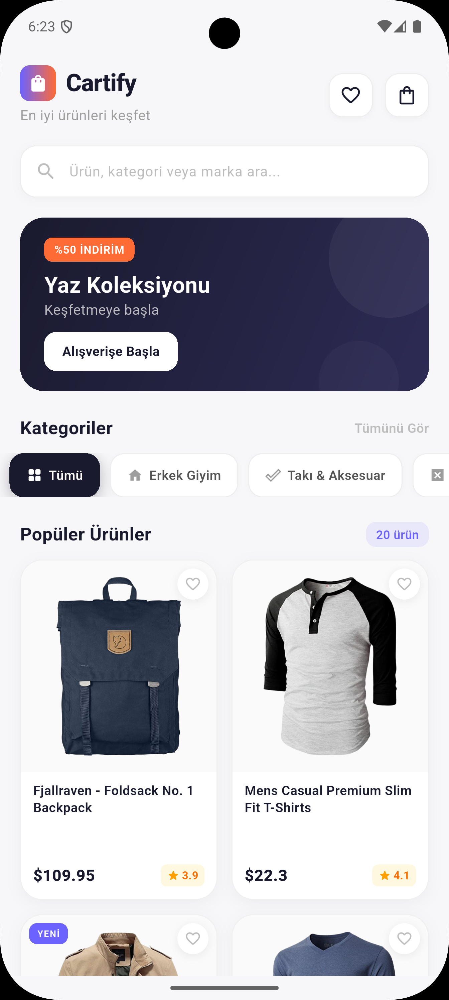
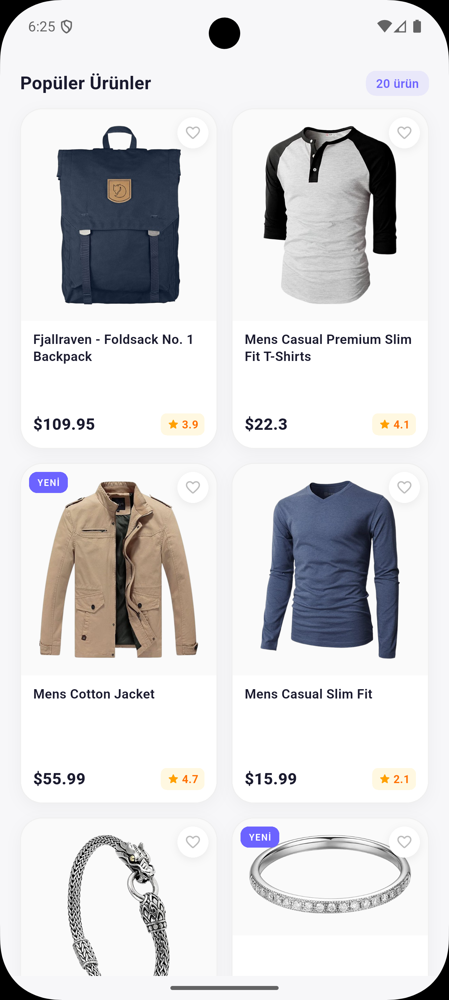
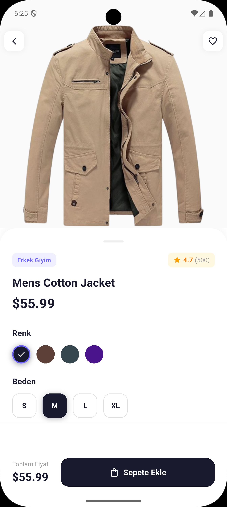
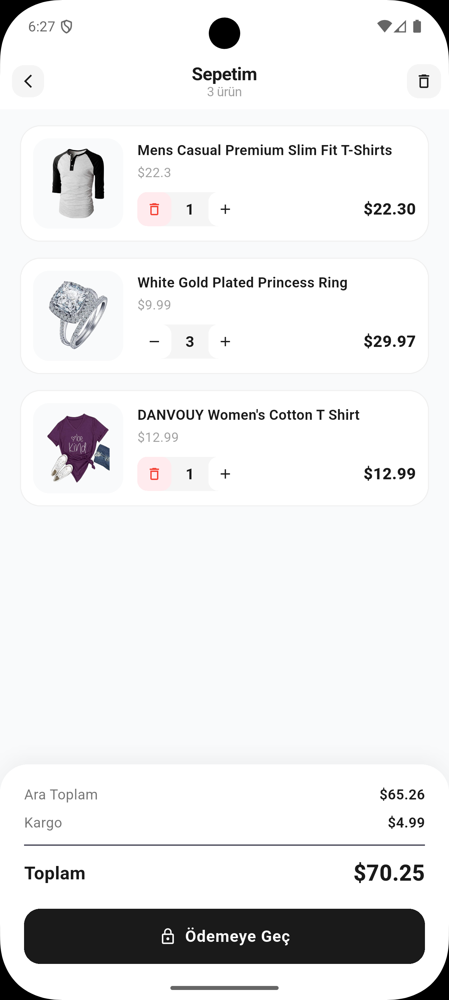
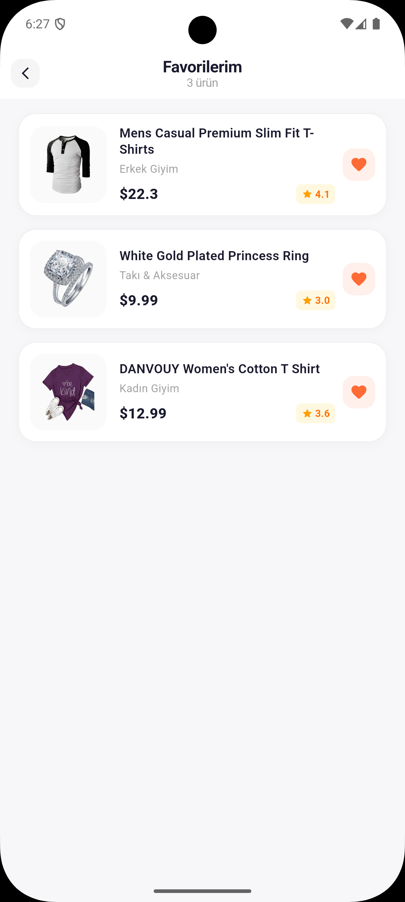

# Cartify

Flutter ile geliştirilmiş modern bir e-ticaret katalog uygulaması.

## Ekran Görüntüleri

| Ana Sayfa | Ürün Listesi | Ürün Detay |
|:---------:|:------------:|:----------:|
|  |  |  |

| Sepet | Favoriler |
|:-----:|:---------:|
|  |  |

## Özellikler

- **Ürün Kataloğu** — GridView ile 20 ürünün listelenmesi
- **Kategori Filtreleme** — Erkek Giyim, Kadın Giyim, Takı & Aksesuar, Elektronik
- **Ürün Arama** — Başlık ve açıklamada anlık arama
- **Ürün Detayı** — Görsel, fiyat, açıklama, renk ve beden seçimi
- **Sepet Sistemi** — Ürün ekleme, miktar artırma/azaltma, swipe ile silme, sipariş özeti
- **Favori Sistemi** — Ürünleri favorilere ekleme/çıkarma
- **Sayfa Navigasyonu** — Named Routes ile sayfa geçişleri ve veri taşıma

## Teknolojiler

| Teknoloji | Açıklama |
|-----------|----------|
| Flutter | UI framework |
| Dart | Programlama dili |
| Material 3 | Tasarım sistemi |

> Ekstra paket kullanılmamıştır. Tüm uygulama yalnızca `material.dart` ile geliştirilmiştir.

## Proje Yapısı

```
lib/
├── main.dart                    # Uygulama girişi, tema ve route tanımları
├── models/
│   ├── product.dart             # Ürün modeli (fromJson / toJson)
│   └── cart_item.dart           # Sepet öğesi modeli
├── data/
│   └── product_data.dart        # JSON simülasyon verisi (20 ürün)
├── screens/
│   ├── home_screen.dart         # Ana sayfa (GridView, arama, filtre)
│   ├── product_detail_screen.dart  # Ürün detay sayfası
│   ├── cart_screen.dart         # Sepet sayfası
│   └── favorites_screen.dart    # Favoriler sayfası
└── widgets/
    ├── product_card.dart        # Ürün kartı widget'ı
    ├── category_chip.dart       # Kategori filtre chip'i
    └── search_bar_widget.dart   # Arama çubuğu widget'ı
```

## Kurulum

```bash
# Repoyu klonlayın
git clone https://github.com/ozkanfurkandev/Cartify.git

# Proje dizinine gidin
cd Cartify

# Bağımlılıkları yükleyin
flutter pub get

# Uygulamayı çalıştırın
flutter run
```

## API

Uygulama, [FakeStoreAPI](https://fakestoreapi.com) formatında hazırlanmış lokal JSON simülasyon verisi kullanmaktadır. Ağ bağlantısı yalnızca ürün görselleri için gereklidir.

## Lisans

Bu proje eğitim amaçlı geliştirilmiştir.
